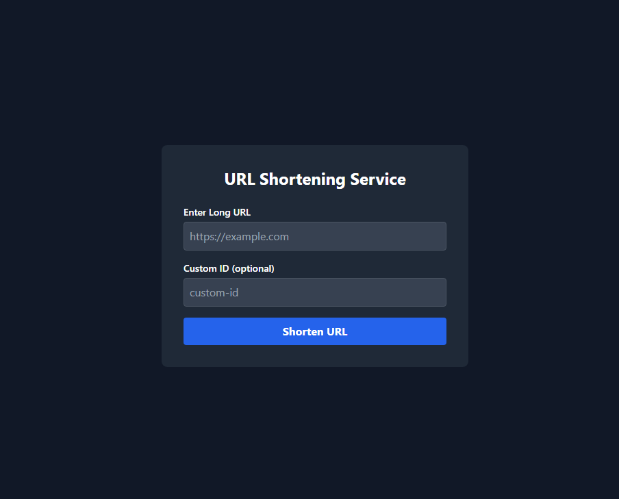
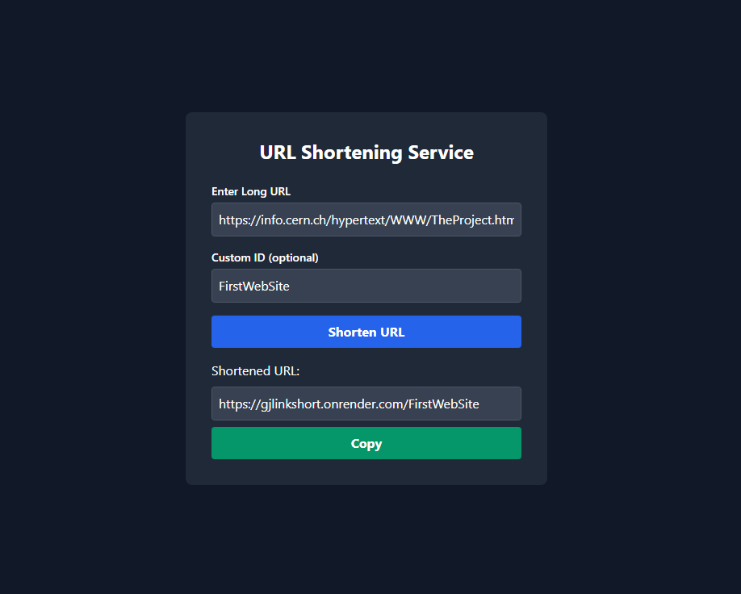

# 🌐 GJ Link Shortener

Welcome to **GJ Link Shortener**! This is a simple and modern web application for shortening URLs, built with Node.js and Firebase. 

## 📸 Preview

Below are screenshots of the application:

### Home Page


### Shortened Link Example


## 🚀 Features
- 🔗 Shorten long URLs quickly and easily
- 🗑️ Automatically deletes expired URLs
- ☁️ Uses Firebase for fast and reliable storage
- 🖥️ Clean and user-friendly interface

## 🛠️ Getting Started

1. **Clone the repository**
   ```sh
   git clone <your-repo-url>
   ```
2. **Install dependencies**
   ```sh
   npm install
   ```
3. **Start the server**
   ```sh
   npm start
   ```
4. **Open in your browser**
   Go to [http://localhost:3000](http://localhost:3000)

## 📁 Project Structure
```
controllers.js         # Handles business logic
routes.js              # API routes
firebase.js            # Firebase configuration
index.js               # Entry point
public/index.html      # Frontend
pic1.png, pic2.png     # Screenshots
```

## 📝 License
MIT

---

Made with ❤️ by GJ
